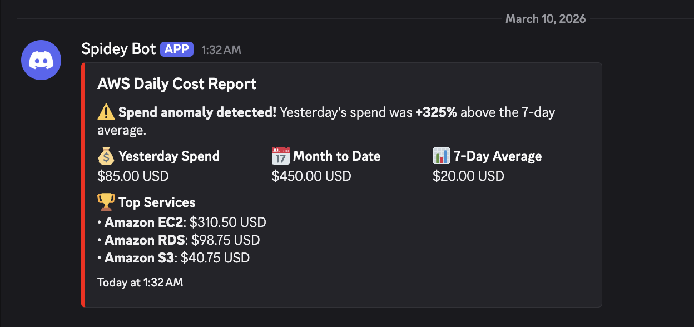
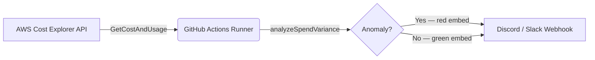

# AWS Cost Guard

### Stop Cloud Bill Shock Before It Happens.

> A zero-infrastructure, self-hosted AWS cost monitor that delivers daily spend reports and anomaly alerts straight to your Discord or Slack — automatically, every morning.



---

## The Problem: That Surprise $500 AWS Bill

You spun up a quick experiment on a Friday. By Monday, a forgotten EC2 instance or a runaway Lambda function has quietly burned through hundreds of dollars. AWS Budgets *can* help, but the default billing alert takes up to 8 hours to fire, requires navigating the console to set up, and sends a plain email to an inbox nobody watches.

**AWS Cost Guard is different.** It runs on your schedule, uses the Cost Explorer API to pull real spend data, detects anomalies against your 7-day average, and sends a rich, colour-coded embed directly to the channel your team actually reads.

---

## Key Features

- **📊 Daily Burn Reports** — Yesterday's spend, month-to-date total, and a top-5 service breakdown, delivered every morning at 09:00 UTC.
- **🚨 Anomaly Detection** — Flags any day where spend is more than 20% above your 7-day rolling average, with a highlighted warning in the embed.
- **⚡ Zero Infrastructure** — Runs entirely inside a GitHub Actions scheduled workflow. No servers, no cron jobs, no cloud functions to manage.
- **💬 Discord & Slack Ready** — Outputs a standard Discord embed (compatible with Slack incoming webhooks). Red embed on anomaly, green on normal.
- **🐳 Self-Hostable** — A hardened, multi-stage Docker image for teams that prefer to run on their own infrastructure.
- **🔐 Least-Privilege by Default** — Ships with a Terraform-managed IAM policy granting only `ce:GetCostAndUsage` — nothing more.

---

## Architecture



---

## Quick Start

### 1. Fork the repository

Click **Fork** on GitHub, then clone your fork locally.

### 2. Add GitHub Secrets

Navigate to your fork → **Settings → Secrets and variables → Actions → New repository secret** and add:

| Secret name | Description |
|---|---|
| `AWS_ACCESS_KEY_ID` | Access key for the IAM user with the `cost-explorer-read-only` policy |
| `AWS_SECRET_ACCESS_KEY` | Corresponding secret key |
| `AWS_REGION` | AWS region to query (e.g. `us-east-1`) |
| `WEBHOOK_URL` | Your Discord or Slack incoming webhook URL |

### 3. Run manually to test

Go to **Actions → Daily Cost Report → Run workflow**.  
A green embed (or red if an anomaly is detected) will appear in your channel within seconds.

### 4. Let the schedule take over

The workflow runs automatically at **09:00 UTC every day**. Adjust the cron expression in [.github/workflows/daily-report.yml](.github/workflows/daily-report.yml) to match your timezone.

---

## Development & Local Testing

No AWS account? No problem. The mock test script runs the entire pipeline with static fixture data and fires a real webhook — great for validating your Discord URL before going live.

```bash
# 1. Install dependencies
npm install

# 2. Configure your webhook URL
cp .env.example .env
# Edit .env and set WEBHOOK_URL to your real Discord webhook

# 3. Run the mock test (uses hardcoded $85 spend vs $20 avg → triggers anomaly)
npm run dev -- src/mock-test.ts
```

Expected output:
```
=== AWS Cost Guard — Mock Test ===

Yesterday spend : $85.00
Month to date   : $450.00
7-day average   : $20.00
Top services    : Amazon EC2, Amazon RDS, Amazon S3

Anomaly detected : true
Variance         : 325%

Formatted Discord embed:
{ ... }

Sending webhook to: https://discord.com/api/webhooks/...
Webhook sent successfully.
```

---

## Self-Hosting with Docker

```bash
cp .env.example .env          # fill in credentials and WEBHOOK_URL
docker compose run --rm cost-guard
```

To run on a recurring schedule from your own server, pair Docker Compose with a host-level cron job:

```cron
0 9 * * * cd /opt/aws-cost-guard && docker compose run --rm cost-guard
```

---

## Security

### Least-Privilege IAM Policy

The included Terraform configuration ([terraform/iam-policy.tf](terraform/iam-policy.tf)) creates an IAM policy with a single permission:

```hcl
actions = ["ce:GetCostAndUsage"]
```

Attach it to the IAM user or OIDC role your GitHub Action assumes. Nothing else is granted.

```bash
cd terraform
terraform init
terraform apply
```

### Hardened Docker Container

The production image runs with:

- ✅ Non-root user (`appuser`)
- ✅ Read-only root filesystem
- ✅ All Linux capabilities dropped (`cap_drop: ALL`)
- ✅ `no-new-privileges` security option
- ✅ Multi-stage build — no compiler, source files, or dev dependencies in the final image

---

## Technical Stack

| Layer | Technology |
|---|---|
| Language | TypeScript 5 (strict mode, ESM) |
| Runtime | Node.js 20 |
| AWS SDK | `@aws-sdk/client-cost-explorer` v3 |
| HTTP | Native `fetch` (Node 20 built-in) |
| Container | Docker (multi-stage, Alpine-based) |
| Orchestration | Docker Compose |
| Infrastructure | Terraform (IAM policy) |
| CI/CD | GitHub Actions |

---

## Environment Variables

| Variable | Required | Default | Description |
|---|---|---|---|
| `AWS_REGION` | ✅ | — | AWS region for Cost Explorer queries |
| `AWS_ACCESS_KEY_ID` | ✅* | — | IAM access key (*not needed with OIDC/instance role) |
| `AWS_SECRET_ACCESS_KEY` | ✅* | — | Corresponding secret key |
| `WEBHOOK_URL` | ✅ | — | Discord or Slack incoming webhook URL |
| `COST_THRESHOLD_USD` | — | `100` | MTD spend (USD) above which a webhook is sent |
| `LOOKBACK_DAYS` | — | `30` | Days of history used for context |

---

## License

[MIT](./LICENSE)
