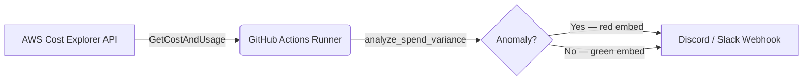

# AWS Cost Guard

### Stop Cloud Bill Shock Before It Happens.

> A zero-infrastructure, self-hosted AWS cost monitor that delivers daily spend reports and anomaly alerts straight to your Discord or Slack — automatically, every morning.


---

## The Problem: That Surprise $500 AWS Bill

You spun up a quick experiment on a Friday. By Monday, a forgotten EC2 instance or a runaway Lambda function has quietly burned through hundreds of dollars. AWS Budgets *can* help, but the default billing alert takes up to 8 hours to fire, requires navigating the console to set up, and sends a plain email to an inbox nobody watches.

**AWS Cost Guard is different.** It runs on your schedule, uses the Cost Explorer API to pull real spend data, detects anomalies against your 7-day average, and sends a rich, colour-coded embed directly to the channel your team actually reads.

---

## Key Features

- **📊 Daily Burn Reports** — Yesterday's spend, month-to-date total, and a top-5 service breakdown, delivered every morning at 09:00 UTC.
- **🚨 Anomaly Detection** — Flags any day where spend is more than 20% above your 7-day rolling average, with a highlighted warning in the embed.
- **⚡ Zero Infrastructure** — Runs entirely inside a GitHub Actions scheduled workflow. No servers, no cron jobs, no cloud functions to manage.
- **💬 Discord & Slack Ready** — Outputs a standard Discord embed (compatible with Slack incoming webhooks). Red embed on anomaly, green on normal.
- **🐳 Self-Hostable** — A hardened, multi-stage Docker image for teams that prefer to run on their own infrastructure.
- **🔐 Least-Privilege by Default** — Ships with a Terraform-managed IAM policy granting only `ce:GetCostAndUsage` — nothing more.

---

## Architecture



---

## One-Time AWS Setup

> **Already an AWS power user?** Skip to the [Terraform path](#option-b-existing-aws-users--terraform) below.

Before the Quick Start steps will work, you need three things from AWS: Cost Explorer enabled, an IAM identity with the right permission, and the correct region. This section walks through both paths — manual (for beginners) and Terraform (for everyone else).

---

### Step 1 — Enable Cost Explorer

Cost Explorer is **not on by default**. If you skip this, the app will throw a `DataUnavailableException` or `User not enabled` error.

1. Sign in to the [AWS Console](https://console.aws.amazon.com).
2. Search for **Cost Explorer** in the top search bar and open it.
3. Click **Launch Cost Explorer** (the big blue button on the landing page).
4. AWS will start ingesting billing data. **It can take up to 24 hours** for historical data to populate. The app will work once data is available — if you run it too soon you may get empty results.

> **Cost:** Enabling Cost Explorer is free. Each API call costs $0.01. At one call per day, that's ~$0.30/month.

---

### Step 2 — Create an IAM Identity with Permissions

Choose the path that matches your situation.

---

#### Option A: New AWS Users — Manual Setup

1. In the AWS Console, go to **IAM → Users → Create user**.
2. Give it a name like `aws-cost-guard`.
3. On the **Permissions** step, choose **Attach policies directly → Create policy**.
4. Switch to the **JSON** tab and paste:

```json
{
  "Version": "2012-10-17",
  "Statement": [
    {
      "Sid": "AllowGetCostAndUsage",
      "Effect": "Allow",
      "Action": ["ce:GetCostAndUsage"],
      "Resource": "*"
    }
  ]
}
```

5. Name the policy `aws-cost-guard-cost-explorer-read-only` and save it.
6. Attach the policy to your new user and finish creating the user.
7. Go to the user → **Security credentials → Create access key** → choose **Application running outside AWS**.
8. Copy the **Access key ID** and **Secret access key** — you will paste these into GitHub Secrets in the next section.

---

#### Option B: Existing AWS Users — Terraform

If you already manage AWS infrastructure with Terraform, use the included configuration to provision the policy automatically. It creates nothing beyond a single least-privilege `aws_iam_policy` resource — no users, no roles.

```bash
cd terraform

# Authenticate however your team normally does (profile, env vars, SSO, etc.)
terraform init
terraform plan   # review what will be created
terraform apply
```

Terraform will output the policy ARN. Attach it to whichever IAM user or OIDC role your GitHub Actions workflow assumes:

```hcl
# Example: attach to an existing OIDC role
resource "aws_iam_role_policy_attachment" "cost_guard_github" {
  role       = aws_iam_role.github_actions.name
  policy_arn = "arn:aws:iam::<ACCOUNT_ID>:policy/aws-cost-guard/aws-cost-guard-cost-explorer-read-only"
}
```

> Using GitHub Actions OIDC (keyless auth) is strongly recommended over long-lived access keys. See the comments in [terraform/iam-policy.tf](terraform/iam-policy.tf) for a full workflow example.

---

### Step 3 — Region Note

Cost Explorer is a **global service**, but its API endpoint is always in `us-east-1`. Set your `AWS_REGION` secret (and the `AWS_REGION` env var locally) to `us-east-1` regardless of where your workloads run — Cost Explorer aggregates spend across all regions automatically.

---

## Quick Start

### 1. Fork the repository

Click **Fork** on GitHub, then clone your fork locally.

### 2. Add GitHub Secrets

Navigate to your fork → **Settings → Secrets and variables → Actions → New repository secret** and add:

| Secret name | Description |
|---|---|
| `AWS_ACCESS_KEY_ID` | Access key for the IAM user with the `cost-explorer-read-only` policy |
| `AWS_SECRET_ACCESS_KEY` | Corresponding secret key |
| `AWS_REGION` | AWS region to query (e.g. `us-east-1`) |
| `WEBHOOK_URL` | Your Discord or Slack incoming webhook URL |

### 3. Run manually to test

Go to **Actions → Daily Cost Report → Run workflow**.  
A green embed (or red if an anomaly is detected) will appear in your channel within seconds.

### 4. Let the schedule take over

The workflow runs automatically at **09:00 UTC every day**. Adjust the cron expression in [.github/workflows/daily-report.yml](.github/workflows/daily-report.yml) to match your timezone.

---

## Development & Local Testing

No AWS account? No problem. The mock test script runs the entire pipeline with static fixture data and fires a real webhook — great for validating your Discord URL before going live.

**Prerequisites:** Python 3.11+

```bash
# 1. Create a virtual environment and install dependencies
python -m venv .venv
source .venv/bin/activate   # Windows: .venv\Scripts\activate
pip install -r requirements.txt

# 2. Configure your webhook URL
cp .env.example .env
# Edit .env and set WEBHOOK_URL to your real Discord webhook

# 3. Run the mock test (uses hardcoded $85 spend vs $20 avg → triggers anomaly)
python -m src.mock_test
```

Expected output:
```
=== AWS Cost Guard — Mock Test ===

Yesterday spend : $85.00
Month to date   : $450.00
7-day average   : $20.00
Top services    : Amazon EC2, Amazon RDS, Amazon S3

Anomaly detected : True
Variance         : 325.0%

Formatted Discord embed:
{ ... }

Sending webhook to: https://discord.com/api/webhooks/...
Webhook sent successfully.
```

---

## Self-Hosting with Docker

```bash
cp .env.example .env          # fill in credentials and WEBHOOK_URL
docker compose run --rm cost-guard
```

To run on a recurring schedule from your own server, pair Docker Compose with a host-level cron job:

```cron
0 9 * * * cd /opt/aws-cost-guard && docker compose run --rm cost-guard
```

---

## Security

### Least-Privilege IAM Policy

The included Terraform configuration ([terraform/iam-policy.tf](terraform/iam-policy.tf)) creates an IAM policy with a single permission:

```hcl
actions = ["ce:GetCostAndUsage"]
```

Attach it to the IAM user or OIDC role your GitHub Action assumes. Nothing else is granted.

```bash
cd terraform
terraform init
terraform apply
```

### Hardened Docker Container

The production image runs with:

- ✅ Non-root user (`appuser`)
- ✅ Read-only root filesystem
- ✅ All Linux capabilities dropped (`cap_drop: ALL`)
- ✅ `no-new-privileges` security option
- ✅ Multi-stage build — no compiler toolchain or build dependencies in the final image

---

## Technical Stack

| Layer | Technology |
|---|---|
| Language | Python 3.11 |
| AWS SDK | `boto3` |
| HTTP | `requests` |
| Container | Docker (multi-stage, Alpine-based) |
| Orchestration | Docker Compose |
| Infrastructure | Terraform (IAM policy) |
| CI/CD | GitHub Actions |

---

## Environment Variables

| Variable | Required | Default | Description |
|---|---|---|---|
| `AWS_REGION` | ✅ | — | AWS region for Cost Explorer queries |
| `AWS_ACCESS_KEY_ID` | ✅* | — | IAM access key (*not needed with OIDC/instance role) |
| `AWS_SECRET_ACCESS_KEY` | ✅* | — | Corresponding secret key |
| `WEBHOOK_URL` | ✅ | — | Discord or Slack incoming webhook URL |
| `COST_THRESHOLD_USD` | — | `100` | MTD spend (USD) above which a webhook is sent |

---

## License

[MIT](./LICENSE)
