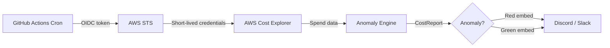

# AWS Cost Guard

[](https://github.com/krishsonvane14/aws-cost-guard/actions/workflows/daily-report.yml)


Stop finding out about AWS bill shock 30 days too late. AWS Cost Guard runs silently every morning, catches spend anomalies the same day they happen, and pings you on Discord or Slack before they compound — with zero servers to maintain and zero IAM keys to rotate or leak.

---

## Why I Built This

AWS bills are reviewed monthly. Anomalies compound daily. Most teams don't find out until the invoice arrives — by which point a misconfigured Lambda or forgotten NAT Gateway has been running for weeks. I wanted a tool that catches the spike on day one, not day thirty.

The design decision to use GitHub Actions instead of a Lambda or EC2 cron was deliberate: zero infrastructure to provision, zero attack surface from stored credentials, and it runs entirely within the GitHub free tier. OIDC federation means GitHub mints a short-lived token at runtime — there are no static AWS keys anywhere in the system.

---

## Features

| Feature | Detail |
|---|---|
| Anomaly detection | 7-day rolling average with configurable threshold (default 20%) |
| Keyless auth | GitHub OIDC → AWS STS, short-lived tokens, no IAM keys stored anywhere |
| Least-privilege IAM | Single permission: `ce:GetCostAndUsage`. Nothing else. |
| Color-coded alerts | Green embed for normal spend, red embed for anomalies |
| Multi-stage Docker | Alpine final image, non-root user (UID 1001), no pip in final layer |
| Strict type safety | mypy strict mode enforced in CI on every push |
| Linting | Ruff (replaces flake8 + black + isort in a single tool) |
| Reproducible builds | pip-compiled lock file — exact same deps in every environment |
| Test coverage gate | 25 tests with moto AWS mocking, 80% coverage enforced in CI |

---

## Tech Stack

| Layer | Tool |
|---|---|
| Language | Python 3.11 |
| AWS SDK | boto3 |
| Authentication | GitHub OIDC + AWS STS |
| Infrastructure as Code | Terraform |
| CI/CD | GitHub Actions |
| Testing | pytest + moto (AWS mocking) |
| Type checking | mypy strict |
| Linting & formatting | Ruff |
| Containerization | Docker (Alpine, multi-stage) |

---

## Architecture


---

## What It Looks Like


**Green embed (normal spend):** shows yesterday's spend, month-to-date total, 7-day average, and top services — all in green.

**Red embed (anomaly detected):** same fields in red, with the percentage spike called out explicitly so you know exactly how far above baseline you are.

---

## Prerequisites

1. **Enable AWS Cost Explorer** — AWS Console → Billing & Cost Management → Cost Explorer → Enable Cost Explorer. Free, one-time. Data takes up to 24 hours to populate on brand new accounts.
2. **AWS CLI installed and configured** with `us-east-1` as the default region — Cost Explorer only responds to requests from `us-east-1`.

---

## Setup

### Path A — Terraform (Recommended)
```bash
cd terraform

# Create terraform.tfvars locally (gitignored — never committed)
cat > terraform.tfvars << 'EOF'
github_org  = "your-github-username"
github_repo = "aws-cost-guard"
aws_region  = "us-east-1"
EOF

terraform init
terraform plan
terraform apply
```

> ⚠️ If you get `AccessDenied` during `terraform apply`, your IAM user needs `IAMFullAccess` temporarily to create the OIDC provider and role. Attach it in **IAM Console → Users → your user → Add permissions**, run `terraform apply`, then immediately remove `IAMFullAccess` — it is not needed after setup.

Copy the output:
```bash
terraform output role_arn
# arn:aws:iam::123456789012:role/aws-cost-guard-github-actions
```

Paste that ARN into your GitHub repo secret `AWS_ROLE_ARN`.

### Path B — Manual IAM Setup

1. Create an OIDC identity provider in **IAM → Identity providers → Add provider**:
   - Provider type: **OpenID Connect**
   - Provider URL: `https://token.actions.githubusercontent.com`
   - Audience: `sts.amazonaws.com`

2. Create an IAM role with this trust policy:
```json
{
  "Version": "2012-10-17",
  "Statement": [
    {
      "Effect": "Allow",
      "Principal": {
        "Federated": "arn:aws:iam::<ACCOUNT_ID>:oidc-provider/token.actions.githubusercontent.com"
      },
      "Action": "sts:AssumeRoleWithWebIdentity",
      "Condition": {
        "StringEquals": {
          "token.actions.githubusercontent.com:aud": "sts.amazonaws.com"
        },
        "StringLike": {
          "token.actions.githubusercontent.com:sub": "repo:<YOUR_ORG>/aws-cost-guard:*"
        }
      }
    }
  ]
}
```

3. Attach this inline policy to the role:
```json
{
  "Version": "2012-10-17",
  "Statement": [
    {
      "Effect": "Allow",
      "Action": ["ce:GetCostAndUsage"],
      "Resource": "*"
    }
  ]
}
```

4. Copy the role ARN and add it as the `AWS_ROLE_ARN` secret in your GitHub repo.

---

## GitHub Secrets

| Secret Name | Value | Required |
|---|---|---|
| `AWS_ROLE_ARN` | IAM role ARN from Terraform output or manual setup | Yes |
| `WEBHOOK_URL` | Discord or Slack incoming webhook URL | Yes |

Navigate to **Settings → Secrets and variables → Actions → New repository secret** to add each one.

---

## Local Development
```bash
git clone https://github.com/krishsonvane14/aws-cost-guard.git
cd aws-cost-guard
make install
cp .env.example .env    # fill in WEBHOOK_URL and AWS_DEFAULT_REGION
python -m src.main
```

---

## Running Tests
```bash
make test               # run full suite (25 tests, 80% coverage gate)
make test-cov           # generate HTML coverage report
open htmlcov/index.html # view in browser
```

---

## Project Structure
```
aws-cost-guard/
├── src/
│   ├── __init__.py          — package marker
│   ├── main.py              — entry point, config loading, orchestration
│   ├── aws_client.py        — AWSCostClient (boto3 Cost Explorer wrapper)
│   ├── anomaly_engine.py    — analyze_spend_variance (pure math, no I/O)
│   ├── formatter.py         — Discord/Slack embed payload builder
│   ├── notifier.py          — webhook delivery via requests
│   ├── models.py            — frozen dataclasses (CostData, ServiceCost, etc.)
│   └── mock_test.py         — manual end-to-end test with static fixtures
├── tests/
│   ├── conftest.py          — session-scoped env var fixtures
│   ├── test_anomaly_engine.py
│   ├── test_aws_client.py   — moto-based AWS mocking
│   ├── test_formatter.py    — payload structure and formatting
│   ├── test_main.py         — integration paths through main()
│   └── test_notifier.py     — webhook delivery + error handling
├── terraform/
│   ├── oidc.tf              — GitHub OIDC provider + IAM role
│   └── versions.tf          — provider version constraints
├── .github/workflows/
│   └── daily-report.yml     — cron schedule + OIDC auth + lint/test/typecheck
├── Dockerfile               — multi-stage, non-root, Alpine-based
├── docker-compose.yml       — local Docker runs with security hardening
├── Makefile                 — dev workflow targets (lint, test, build, lock)
├── pyproject.toml           — unified config (build, ruff, mypy, pytest)
├── requirements.in          — pip-tools source (runtime deps only)
├── requirements.txt         — pinned runtime dependencies
├── requirements.lock        — pinned runtime + dev dependencies
└── .dockerignore            — excludes tests, terraform, .github from image
```

> `terraform.tfvars` is gitignored and not present in a fresh clone. Create it locally using the example in the Setup section above.

---

## Security Model

Security was a first-class concern from the start, not an afterthought.

- **OIDC authentication** — No static AWS keys exist anywhere in this system. At runtime, GitHub mints a short-lived OIDC token (1-hour TTL) which is exchanged for temporary AWS credentials via `sts:AssumeRoleWithWebIdentity`. The trust policy is scoped to `repo:<org>/aws-cost-guard:*` — only workflows running from this specific repository can assume the role. An attacker with knowledge of the role ARN still cannot assume it without a valid GitHub-issued token for this repo.

- **Least-privilege IAM** — The role's inline policy grants exactly one permission: `ce:GetCostAndUsage`. No S3, no EC2, no IAM write access — nothing else. Even if the credentials were somehow compromised, the blast radius is read-only access to billing data.

- **Non-root Docker** — The production image runs as `appuser` (UID 1001). The final Alpine stage contains no pip, setuptools, or wheel — only the installed packages needed to run the tool. The docker-compose config adds `cap_drop: ALL`, `read_only: true`, and `no-new-privileges` for defence in depth.

---

## Design Decisions

- **Python over TypeScript** — boto3 is the lingua franca of the AWS/SRE ecosystem. Most ops teams already have it in their environment. A tool people can actually fork matters more than tech stack novelty.
- **GitHub Actions over Lambda or EC2** — zero infrastructure to provision or maintain, zero cost within the free tier, and secrets management is built in. A Lambda cron would need its own IAM execution role, VPC considerations, and deployment pipeline — all unnecessary complexity for a daily read-only job.
- **OIDC over IAM users** — IAM user keys have no automatic expiry, must be manually rotated, and are a common source of credential leaks. OIDC tokens are minted fresh for each workflow run, scoped to the specific repo, and expire after one hour.
- **moto over mocking boto3 directly** — moto intercepts at the HTTP layer, so tests exercise the actual boto3 call shape, parameter validation, and response parsing — not just the mock interface.
- **Ruff over flake8 + black** — single tool, faster than both combined, handles linting and formatting in one pass. One less dependency to pin and update.

---

## Troubleshooting

| Error | Cause | Fix |
|---|---|---|
| `DataUnavailableException` | Cost Explorer not enabled or too new | Enable Cost Explorer in AWS Console and wait up to 24 hours |
| `AccessDeniedException` | Role missing `ce:GetCostAndUsage` | Verify `terraform apply` completed successfully |
| `Could not assume role with OIDC` | Wrong `github_org` in `terraform.tfvars` | Ensure `github_org` matches your exact GitHub username — case-sensitive |
| `Missing required env var: WEBHOOK_URL` | Secret named incorrectly in GitHub | Add secret named `WEBHOOK_URL` (not `DISCORD_WEBHOOK_URL`) in repo Settings |
| `ModuleNotFoundError` | Stale pip cache or missing dep in lock file | Run `make lock`, commit updated `requirements.txt` and `requirements.lock`, re-run workflow |
| `Unsupported Terraform Core version` | Old Terraform installed | Run `brew tap hashicorp/tap && brew install hashicorp/tap/terraform` |

---

## Contributing

1. Fork the repo and create a feature branch.
2. Run `make lint` and `make typecheck` — both must pass before opening a PR.
3. Add tests for new functionality (`make test`).
4. Open a pull request against `main`.

See [Issues](https://github.com/krishsonvane14/aws-cost-guard/issues) for open tasks.

---

## License

[MIT](./LICENSE)