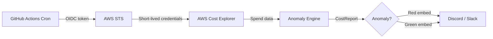

# AWS Cost Guard

[](https://github.com/krishkumar/aws-cost-guard/actions/workflows/daily-report.yml)


A zero-infrastructure AWS spend monitor that runs as a daily GitHub Actions cron job. It pulls yesterday's spend from AWS Cost Explorer, compares it against your 7-day rolling average to detect anomalies, and posts a color-coded alert to Discord or Slack. Authentication uses GitHub OIDC federation — no static IAM keys to store, rotate, or leak.

---

## Architecture



---

## Setup

### Path A — Terraform (Recommended)

```bash
cd terraform
# Set your GitHub username in terraform.tfvars
terraform init
terraform plan
terraform apply
```

Copy the output:

```bash
terraform output role_arn
# arn:aws:iam::123456789012:role/aws-cost-guard-github-actions
```

Paste that ARN into your GitHub repo secret `AWS_ROLE_ARN`.

### Path B — Manual IAM Setup

1. Create an OIDC identity provider in **IAM → Identity providers → Add provider**:
   - Provider type: **OpenID Connect**
   - Provider URL: `https://token.actions.githubusercontent.com`
   - Audience: `sts.amazonaws.com`

2. Create an IAM role with this trust policy:

```json
{
  "Version": "2012-10-17",
  "Statement": [
    {
      "Effect": "Allow",
      "Principal": {
        "Federated": "arn:aws:iam::<ACCOUNT_ID>:oidc-provider/token.actions.githubusercontent.com"
      },
      "Action": "sts:AssumeRoleWithWebIdentity",
      "Condition": {
        "StringEquals": {
          "token.actions.githubusercontent.com:aud": "sts.amazonaws.com"
        },
        "StringLike": {
          "token.actions.githubusercontent.com:sub": "repo:<YOUR_ORG>/aws-cost-guard:ref:refs/heads/main"
        }
      }
    }
  ]
}
```

3. Attach this inline policy to the role:

```json
{
  "Version": "2012-10-17",
  "Statement": [
    {
      "Effect": "Allow",
      "Action": ["ce:GetCostAndUsage"],
      "Resource": "*"
    }
  ]
}
```

4. Copy the role ARN and add it as the `AWS_ROLE_ARN` secret in your GitHub repo.

---

## GitHub Secrets

| Secret Name | Value | Required |
|---|---|---|
| `AWS_ROLE_ARN` | IAM role ARN from Terraform output or manual setup | Yes |
| `DISCORD_WEBHOOK_URL` | Discord incoming webhook URL | Yes* |
| `SLACK_WEBHOOK_URL` | Slack incoming webhook URL | No |

\* At least one webhook URL is required.

Navigate to **Settings → Secrets and variables → Actions → New repository secret** to add each one.

---

## Local Development

```bash
git clone https://github.com/krishkumar/aws-cost-guard.git
cd aws-cost-guard
make install
cp .env.example .env    # fill in your webhook URL
python -m src.main
```

---

## Running Tests

```bash
make test               # run full suite (25 tests, 80% coverage gate)
make test-cov           # generate HTML coverage report
```

---

## Project Structure

```
aws-cost-guard/
├── src/
│   ├── __init__.py          — package marker
│   ├── main.py              — entry point, config loading, orchestration
│   ├── aws_client.py        — AWSCostClient (boto3 Cost Explorer wrapper)
│   ├── anomaly_engine.py    — analyze_spend_variance (pure math, no I/O)
│   ├── formatter.py         — Discord/Slack embed payload builder
│   ├── notifier.py          — webhook delivery via requests
│   ├── models.py            — frozen dataclasses (CostData, ServiceCost, etc.)
│   └── mock_test.py         — manual end-to-end test with static fixtures
├── tests/
│   ├── conftest.py          — session-scoped env var fixtures
│   ├── test_anomaly_engine.py
│   ├── test_aws_client.py   — moto-based AWS mocking
│   ├── test_formatter.py    — payload structure and formatting
│   ├── test_main.py         — integration paths through main()
│   └── test_notifier.py     — webhook delivery + error handling
├── terraform/
│   ├── oidc.tf              — GitHub OIDC provider + IAM role
│   ├── versions.tf          — provider version constraints
│   └── terraform.tfvars     — variable values (set github_org)
├── .github/workflows/
│   └── daily-report.yml     — cron schedule + OIDC auth + lint/test
├── Dockerfile               — multi-stage, non-root, Alpine-based
├── docker-compose.yml       — local Docker runs with security hardening
├── Makefile                 — dev workflow targets (lint, test, build)
├── pyproject.toml           — unified config (build, ruff, mypy, pytest)
├── requirements.in          — pip-tools source (runtime deps)
├── requirements.txt         — pinned runtime dependencies
├── requirements.lock        — pinned runtime + dev dependencies
└── .dockerignore            — excludes tests, terraform, .github from image
```

---

## Security Model

- **OIDC authentication** — No static AWS keys are stored anywhere. GitHub mints a short-lived OIDC token (1-hour TTL), which is exchanged for temporary AWS credentials via `sts:AssumeRoleWithWebIdentity`. The trust policy is scoped to `repo:<org>/aws-cost-guard:ref:refs/heads/main` — only the `main` branch of this specific repository can assume the role.
- **Least-privilege IAM** — The role's inline policy grants exactly one permission: `ce:GetCostAndUsage`. No S3, no EC2, no IAM — nothing else.
- **Non-root Docker** — The production image runs as `appuser` (UID 1001). The final stage is Alpine-based with no pip, setuptools, or wheel installed. The docker-compose config adds `cap_drop: ALL`, `read_only: true`, and `no-new-privileges`.

---

## Contributing

1. Fork the repo and create a feature branch.
2. Run `make lint` and `make typecheck` — both must pass.
3. Add tests for new functionality (`make test`).
4. Open a pull request against `main`.

See [Issues](https://github.com/krishkumar/aws-cost-guard/issues) for open tasks.

---

## License

[MIT](./LICENSE)
